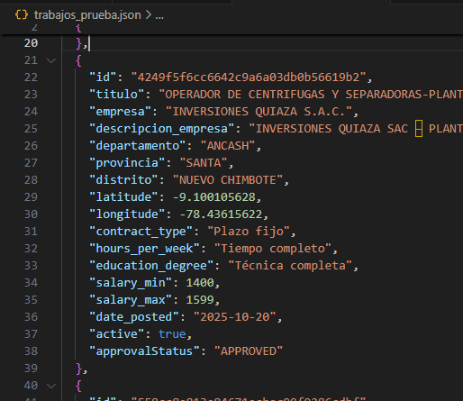

# web con metricas y contadores

En este proyecto se recopila la lista de empleos que aparecen en la pagina del ministerio de trabajo y promocion del empleo.

## Vista previa


## Características

- Consumo directo del API pública del Ministerio de Trabajo.
- Descarga y filtrado de empleos en formato JSON.
- Opcionalmente guarda resultados en base de datos o archivos locales.
- si quitas el atributo LIMIT trae alrededor de 1500 ofertas laborales.


## 🛠️ Tecnologías utilizadas

- Python 3.10+
- Requests
- Pandas
- CSV
- API REST pública del MTPE
- Dataset de ubigeos del Perú

## ⚙️ Instalación

Sigue estos pasos para correr el proyecto en tu máquina local:

1. Clona el repositorio:
   ```bash
   git clone https://github.com/luisAngelDev/django-scraping.git
   cd django-scraping
   ```

2. Crea y activa un entorno virtual:
   ```bash
   python -m venv venv
   venv\Scripts\activate
   ```

3. Instala las dependencias:
   ```bash
   pip install -r requirements.txt
   ```

4. Ejecuta el archivo que lee el achivo csv:
   ```bash
   python convertir_ubigeo.py
   ```

5. Luego ejecuta scrapers.py que lee el json generado en convertir_ubigeo.py :
   ```bash
   python scrapers.py
   ```

6. una ves ejecutados se guardará en:
   ```bash
   (venv) D:\UNIVERSIDAD\PROY-DJANGO-SCRAPING>python scrapers.py
    Guardadas 5 ofertas en 'trabajos_prueba.json'
   ```


## 📂 Estructura del proyecto

```plaintext
django-scraping/
├── .gitignore
├── Lista_Ubigeos_INEI.csv      # Dataset auxiliar con información geográfica del Perú
├── convertir_ubigeo.py         # Convierte el CSV de ubigeos a JSON
├── scrapers.py                 # Script principal que extrae datos del Ministerio de Trabajo (API pública)
├── ubigeos.json                # JSON generado desde el CSV
├── trabajos_prueba.json        # Archivo de ejemplo con las ofertas laborales
├── requirements.txt            # Dependencias del proyecto
├── README.md                   # Este archivo
└── venv/                       # Entorno virtual (ignorado por git)
```

## 👨‍💻 Autor

**Luis Ramos**  
[GitHub: @luisAngelDev](https://github.com/luisAngelDev) 

## 📄 Licencia
Este proyecto está bajo la Licencia MIT - consulta el archivo [LICENSE](./LICENSE) para más detalles.
